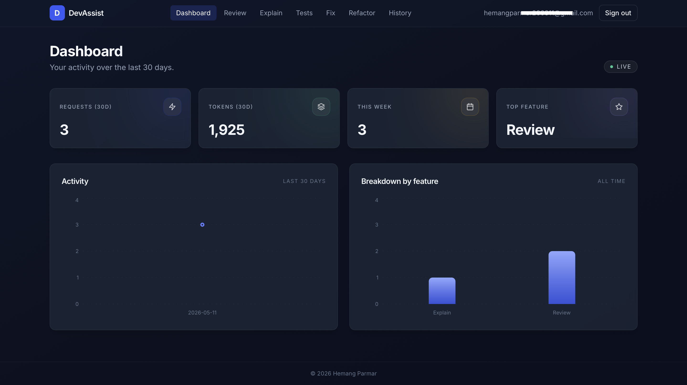
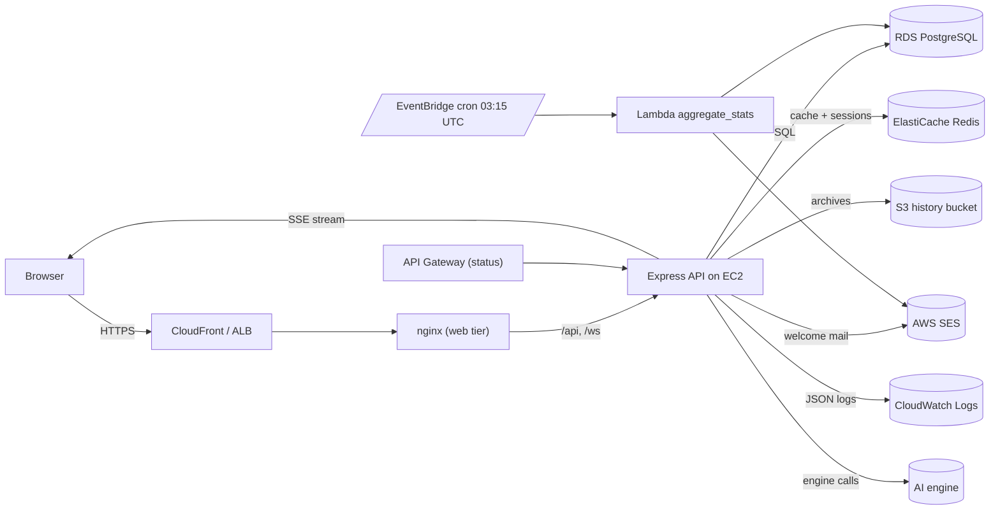

# DevAssist — AI Developer Productivity Platform

> Author: **Hemang Parmar**
> License: MIT — © 2026 Hemang Parmar

DevAssist is a full-stack web platform that gives developers a single workspace
for the most common kinds of code work: structured review, plain-English
explanation, test generation, bug fixing with diffs, and goal-directed
refactors. Output streams in token-by-token so the experience stays snappy,
identical inputs are served from a Redis cache, and every interaction is
archived for the user's dashboard.

The platform is built for production from day one: Postgres on RDS, Redis on
ElastiCache, file archives on S3, transactional email via SES, structured
logging to CloudWatch, nightly aggregation via a scheduled Lambda, and a
GitHub Actions pipeline that ships changes to EC2 with zero downtime.

---

## Features

- **Code Review Assistant** — paste a snippet, pick a focus (bugs, security,
  performance, best-practices), get a Markdown report with severity-tagged
  issues and concrete fixes.
- **Code Explainer** — high-level or line-by-line walkthrough. Identical
  inputs are served from the Redis cache.
- **Test Generator** — full test suite for the chosen framework (Jest,
  PyTest, JUnit, `go test`) including mocks and edge cases.
- **Bug Fixer** — diagnosis + fixed code + changelog, with a side-by-side
  diff against the original.
- **Refactor Assistant** — goal-directed refactors (readability, performance,
  DRY, modularisation) with a risk note for reviewers.
- **Usage Dashboard** — 30-day activity chart, feature breakdown, full history
  log with one-click open of any archived run. Weekly digest email summarises
  activity.

---

## Screenshots



---

## Architecture



---

## Tech stack

| Layer        | Stack                                                                                              |
| ------------ | -------------------------------------------------------------------------------------------------- |
| Frontend     | React 18, TypeScript (strict), Tailwind CSS, Monaco Editor, Recharts, React Query, Axios, Vite     |
| Backend      | Node.js 20, Express, TypeScript (strict), Zod, JWT + bcrypt, Socket.io, express-rate-limit, Winston |
| Streaming    | Server-Sent Events for AI output; Socket.io for ambient real-time signals                          |
| Data         | PostgreSQL (RDS in prod, Docker locally), Redis (ElastiCache in prod, Docker locally)              |
| AI engine    | Streaming Messages API consumed via SSE — referenced as the "AI engine" throughout the platform    |
| AWS          | EC2, S3, Lambda, RDS, ElastiCache, CloudWatch, SES, API Gateway, ECR                               |
| Tooling      | Docker, Docker Compose, GitHub Actions, ESLint, Prettier, Jest                                     |

---

## Repository layout

```
devassist/
├── frontend/          React + TypeScript client
├── backend/           Express API (services, routes, prompts, tests, migrations)
├── docker/            Multi-stage Dockerfiles + docker-compose for local dev
├── infrastructure/    EC2 deploy script, systemd unit, S3 setup, Lambda, CloudWatch, API Gateway
├── .github/workflows/ CI/CD pipeline
├── .env.example       Local development config template
└── README.md          this file
```

---

## Getting started (local)

```bash
git clone https://github.com/hemangparmar/devassist.git
cd devassist
cp .env.example .env
# Edit .env and set AI_ENGINE_API_KEY at minimum.
# AWS_* values are optional locally — only S3/SES/CloudWatch features need them.

docker compose -f docker/docker-compose.yml --env-file .env up --build
```

The compose file boots Postgres, Redis, the API, and the nginx-served
frontend. The API container runs migrations automatically on first start.

| URL                          | What                  |
| ---------------------------- | --------------------- |
| http://localhost:5173        | Web client            |
| http://localhost:4000/api/health | API liveness probe |
| http://localhost:4000/api/status | Deep readiness check |

To stop everything: `docker compose -f docker/docker-compose.yml down`.

### Without Docker

```bash
# backend
cd backend && npm install && npm run migrate && npm run dev

# frontend (in another terminal)
cd frontend && npm install && npm run dev
```

You'll need a local Postgres and Redis running on the ports in `.env`.

### Tests

```bash
cd backend && npm run test:coverage
cd frontend && npm run lint && npm run build
```

The backend suite uses Jest with mocked external services so it runs in pure
CI without an AWS account or live AI engine.

---

## Production deployment (EC2)

1. **Bake the infrastructure once:**
   - Provision an RDS Postgres instance and run `backend/src/db/migrations/001_initial.sql` against it.
   - Provision an ElastiCache Redis cluster.
   - Create the S3 bucket: `S3_BUCKET=devassist-history-prod AWS_REGION=us-east-1 ./infrastructure/s3_setup.sh`.
   - Apply CloudWatch log groups, metric filters, and alarms: `./infrastructure/cloudwatch_setup.sh`.
   - Build and deploy the nightly Lambda:
     ```
     cd infrastructure/lambda && ./build.sh
     aws lambda create-function \
       --function-name devassist-aggregate-stats \
       --runtime nodejs20.x \
       --handler aggregate_stats.handler \
       --zip-file fileb://aggregate_stats.zip \
       --role arn:aws:iam::ACCT:role/devassist-aggregate-stats \
       --environment "Variables={DATABASE_URL=...,SES_FROM_EMAIL=...}"
     aws events put-rule --cli-input-json file://eventbridge_rule.json
     ```
   - (Optional) Import `infrastructure/api_gateway.json` to expose `/api/health`
     and `/api/status` via API Gateway as a public status page.

2. **Bootstrap a fresh Ubuntu 22.04 EC2 host:**
   - Attach an instance role with `AmazonS3FullAccess` (scoped to the bucket),
     `AmazonSESFullAccess` (scoped to the verified identity), and
     `CloudWatchLogsFullAccess` (scoped to the log group).
   - Copy `infrastructure/.env.production.example` to `/opt/devassist/.env`
     and fill in real values (RDS URL, Redis URL, JWT secret, AI engine key).
   - Run `ECR_REGISTRY=... AWS_REGION=us-east-1 APP_TAG=latest ./infrastructure/deploy.sh`
     to install Docker + AWS CLI, register the systemd unit, pull the latest
     image from ECR, and start the service.

3. **From then on:** push to `main`. The GitHub Actions pipeline runs lint
   and tests, builds the API image, pushes it to ECR, SSHes into the EC2
   host, and runs `deploy.sh` for a zero-downtime rolling restart. The Lambda
   is re-packaged and updated on the same run.

### Required GitHub Actions secrets

| Secret                  | Used by                       |
| ----------------------- | ----------------------------- |
| `AWS_ACCESS_KEY_ID`     | ECR push, Lambda update       |
| `AWS_SECRET_ACCESS_KEY` | ECR push, Lambda update       |
| `EC2_HOST`              | SSH target for deploy script  |
| `EC2_SSH_KEY`           | Private key for the SSH user  |

Other configuration (JWT secret, RDS URL, Redis URL, `AI_ENGINE_API_KEY`,
`SES_FROM_EMAIL`) lives in `/opt/devassist/.env` on the host — typically
fetched from SSM Parameter Store at boot.

---

## Environment variables

| Variable                  | Purpose                                                                | Required |
| ------------------------- | ---------------------------------------------------------------------- | -------- |
| `NODE_ENV`                | `development` / `test` / `production`                                  | yes      |
| `PORT`                    | API HTTP port (default 4000)                                           | no       |
| `FRONTEND_ORIGIN`         | CORS allow-list for the web client                                     | yes      |
| `JWT_SECRET`              | Signing key for access tokens (≥ 16 chars)                             | yes      |
| `JWT_ACCESS_TTL`          | Access token lifetime, e.g. `15m`                                      | no       |
| `JWT_REFRESH_TTL`         | Refresh token lifetime, e.g. `30d`                                     | no       |
| `BCRYPT_ROUNDS`           | Password hash cost (default 12)                                        | no       |
| `DATABASE_URL`            | Postgres connection string                                             | yes      |
| `REDIS_URL`               | Redis connection string                                                | yes      |
| `AI_ENGINE_API_KEY`       | Auth key for the AI engine                                             | yes      |
| `AI_ENGINE_MODEL`         | Engine model id supplied to the AI engine SDK                          | no       |
| `AI_ENGINE_MAX_TOKENS`    | Max output tokens per call                                             | no       |
| `AWS_REGION`              | Region for S3, SES, CloudWatch                                         | yes      |
| `AWS_ACCESS_KEY_ID`       | Local dev only — EC2 uses the instance role                            | no       |
| `AWS_SECRET_ACCESS_KEY`   | Local dev only                                                         | no       |
| `S3_BUCKET`               | Bucket for archived outputs                                            | yes      |
| `SES_FROM_EMAIL`          | Verified SES "from" address                                            | yes      |
| `CLOUDWATCH_LOG_GROUP`    | Log group name (default `/devassist/api`)                              | no       |
| `CLOUDWATCH_LOG_STREAM`   | Stream prefix (default `local`)                                        | no       |
| `RATE_LIMIT_AI_PER_MIN`   | Per-user limit on AI calls (default 20)                                | no       |

---

## API reference

All responses follow the envelope:

```json
{ "success": true,  "data": { "...": "..." }, "error": null, "timestamp": "..." }
{ "success": false, "data": null, "error": { "code": "...", "message": "...", "details": [...] }, "timestamp": "..." }
```

| Method | Path                       | Auth | Description                                                |
| ------ | -------------------------- | :--: | ---------------------------------------------------------- |
| POST   | `/api/auth/register`       |  —   | Create an account; sends welcome email via SES             |
| POST   | `/api/auth/login`          |  —   | Returns access + refresh tokens                            |
| POST   | `/api/auth/refresh`        |  —   | Rotate a refresh token                                     |
| POST   | `/api/auth/logout`         |  —   | Revoke a refresh token                                     |
| GET    | `/api/user/profile`        |  ✓   | Current user                                               |
| POST   | `/api/ai/review`           |  ✓   | Streaming review (SSE)                                     |
| POST   | `/api/ai/explain`          |  ✓   | Streaming explanation (SSE); Redis cache hit when possible |
| POST   | `/api/ai/generate-tests`   |  ✓   | Streaming test-suite generation                            |
| POST   | `/api/ai/fix-bug`          |  ✓   | Streaming bug fix with changelog                           |
| POST   | `/api/ai/refactor`         |  ✓   | Streaming refactor                                         |
| GET    | `/api/dashboard/stats`     |  ✓   | 30-day activity + feature breakdown                        |
| GET    | `/api/dashboard/history`   |  ✓   | Paginated request history                                  |
| GET    | `/api/history/:id`         |  ✓   | Full archived output for one request (from S3)             |
| GET    | `/api/health`              |  —   | Liveness probe                                             |
| GET    | `/api/status`              |  —   | Deep readiness (Postgres + Redis)                          |

### SSE event grammar

Each AI route emits:

```
event: meta    data: {"requestId":"…","feature":"review","cached":false}
event: token   data: {"text":"## Summary\n…"}
event: token   data: {"text":"…"}
event: done    data: {"tokensUsed": 1483, "cached": false}
```

Or, on failure:

```
event: error   data: {"message":"Engine error — please retry."}
```

A cached response replays its stored output as a sequence of `token` events
so the client UX is identical to a live call.

---

## Security notes

- Passwords are hashed with bcrypt (cost 12 in production).
- Refresh tokens are stored hashed; a DB leak does not yield usable tokens.
- All API responses use a single error envelope — no stack traces or
  internal messages reach the client.
- Helmet, CORS allow-list, JSON-body size cap, and per-user rate limits are
  applied at the Express layer.
- S3 archives use SSE-AES256 and the bucket has Block Public Access enforced.
- Secrets are never committed; the CI pipeline injects them from GitHub
  Actions secrets and the EC2 systemd unit reads `/opt/devassist/.env`.

---

## License

MIT — see [LICENSE](LICENSE). Copyright © 2026 Hemang Parmar.
